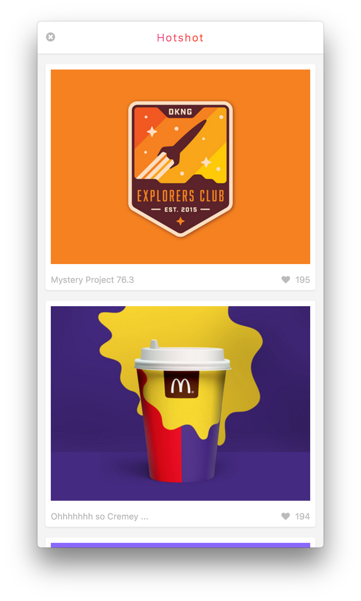

# Hotshot
#### v0.3.0
#### A menubar app for Dribbble.

Hotshot is a simple menubar app for viewing the latest popular shots on [Dribbble](http://dribbble.com) built with Github's Electron.

#### Installation
- Clone the repo to somewhere on your computer using `git clone git@github.com:andrewnaumann/hotshot.git`
- Navigate inside the directory using `cd hotshot`
- Install application dependencies by running `npm install`
- There is an application build script already setup inside the package.json file for Mac OSX 64bit. Execute the script by running `npm run package`
- If everything builds successfully a Hotshot-darwin-64 folder will be created with the executable labeled 'Hotshot' inside

#### Status
Hotshot was just rewritten using Vue.js instead of React.
The codebase is much smaller and easier to work with.
New features include an infinite scroll and auto refreshing content after a period of inactivity.
